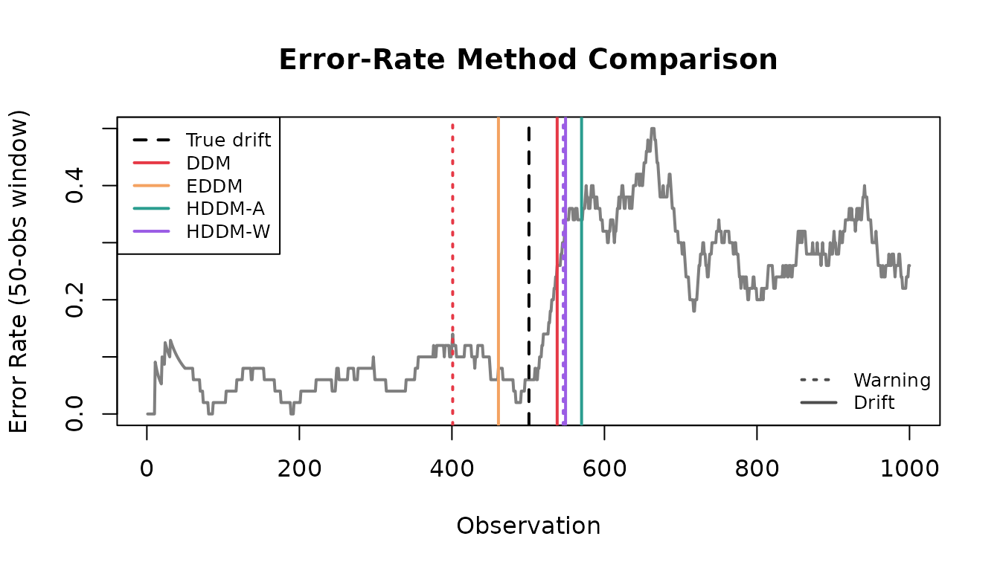
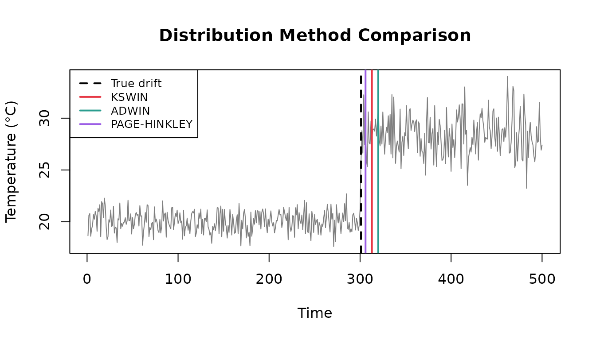
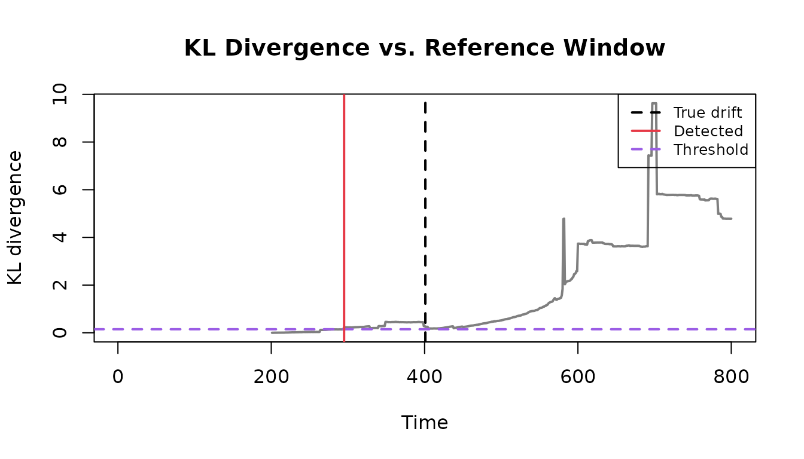
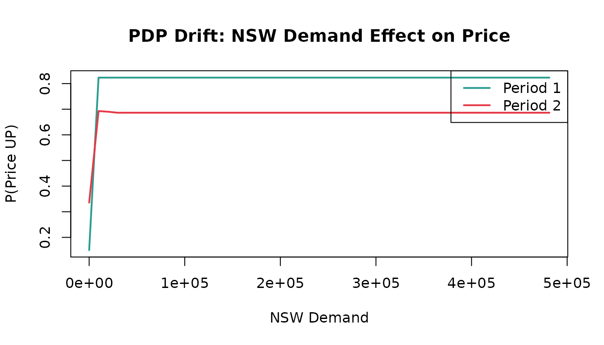

# Drift Detection with datadriftR

## Introduction

In production, the data generating process rarely stays still.
Seasonality, product changes, user behavior, and policy updates can
shift the distribution of your features—and sometimes even change the
relationship between features and the target.

**Example (concept drift):** You train a model to predict whether
electricity prices will go up based on demand and price signals. After a
market reform, the same demand level can imply a different price
movement. In practice this often shows up as a rising error rate or
shifting model outputs.

**datadriftR** helps you detect these shifts early in streaming
settings, so you can trigger investigation, retraining, or alerts.

## Drift Taxonomy

Many “drift” problems are forms of **dataset shift**:

$$P_{train}(X,Y) \neq P_{prod}(X,Y)$$

What changed?

- **Covariate shift:** $P(X)$ changes while $P\left( Y|X \right)$ stays
  roughly the same.
- **Concept drift:** $P\left( Y|X \right)$ changes (the mapping from
  inputs to outputs changes).

## Drift Patterns

Drift can also differ by **how it unfolds over time**:

- **Abrupt:** change happens at once (deployments, outages, policy
  changes)
- **Gradual:** mixture of old/new concepts (slow adoption, rollout)
- **Incremental:** continuously moving distribution (wear-and-tear,
  trend)
- **Recurring:** seasonal or cyclical patterns (day/night, weekdays,
  holidays)


Common drift patterns

## Available Methods

| Method                                        | What you feed                              |
|:----------------------------------------------|:-------------------------------------------|
| **DDM, EDDM, HDDM-A/W**                       | Binary (0/1) error stream                  |
| **KSWIN, ADWIN, Page-Hinkley, KL Divergence** | Numeric stream (or rolling window/batches) |
| **ProfileDifference**                         | Two profiles (e.g., PDPs)                  |

------------------------------------------------------------------------

## Quick Start

Quick start with
[`detect_drift()`](https://ugurdar.github.io/datadriftR/reference/detect_drift.md):

``` r
set.seed(1)
x <- c(rnorm(300, 0, 1), rnorm(200, 3, 1))

detect_drift(x, method = "page_hinkley", delta = 0.05, threshold = 50)
#>   index    value  type
#> 1   315 2.964078 drift
```

------------------------------------------------------------------------

## Part 1: Error-Rate Detectors (Binary Stream)

These methods monitor a stream of **prediction errors**:

``` r
error_stream <- as.integer(y_pred != y_true)
```

They work well when you can observe labels reasonably quickly (or with a
known delay).

### Simulating Model Errors

``` r
set.seed(123)

n_good <- 500
n_bad <- 500
error_stream <- c(
  rbinom(n_good, 1, prob = 0.05),
  rbinom(n_bad, 1, prob = 0.30)
)
true_drift_error <- n_good + 1
```

### Comparing All Error-Rate Methods

``` r
error_methods <- c("ddm", "eddm", "hddm_a", "hddm_w")

first_index <- function(res, type) {
  idx <- res$index[res$type == type]
  if (length(idx) == 0) NA_integer_ else idx[1]
}

error_results <- do.call(rbind, lapply(error_methods, function(m) {
  res <- detect_drift(error_stream, method = m, include_warnings = TRUE)
  warning_idx <- first_index(res, "warning")
  drift_idx <- first_index(res, "drift")
  data.frame(
    Method = gsub("_", "-", toupper(m)),
    Warning = warning_idx,
    Drift = drift_idx,
    DriftDelay = if (!is.na(drift_idx)) drift_idx - true_drift_error else NA,
    stringsAsFactors = FALSE
  )
}))

error_results
#>   Method Warning Drift DriftDelay
#> 1    DDM     401   538         37
#> 2   EDDM      NA   461        -40
#> 3 HDDM-A     548   570         69
#> 4 HDDM-W     546   549         48
```



### Online Processing (Streaming)

``` r
ddm <- DDM$new()
drifts <- c()

for (i in seq_along(error_stream)) {
  ddm$add_element(error_stream[i])
  if (ddm$change_detected) {
    drifts <- c(drifts, i)
    ddm$reset()
  }
}

data.frame(Method = "DDM", True = true_drift_error, Detected = drifts)
#>   Method True Detected
#> 1    DDM  501      538
```

The loop above is the “low-level” way to run a detector. For
convenience,
[`detect_drift()`](https://ugurdar.github.io/datadriftR/reference/detect_drift.md)
provides the same idea as a single function call:

``` r
ddm_res <- detect_drift(error_stream, method = "ddm", include_warnings = FALSE)
ddm_res
#>   index value  type
#> 1   538     1 drift
```

------------------------------------------------------------------------

## Part 2: Continuous-Stream Detectors (Numeric Data)

These methods work with **any numeric stream**—sensor readings, feature
values, model predictions.

### Simulating Sensor Data

``` r
set.seed(456)

n_normal <- 300
n_faulty <- 200
sensor_stream <- c(
  rnorm(n_normal, mean = 20, sd = 1),
  rnorm(n_faulty, mean = 28, sd = 2)
)
true_drift_sensor <- n_normal + 1
```

### Comparing All Distribution Methods

``` r
dist_methods <- c("kswin", "adwin", "page_hinkley")

dist_results <- do.call(rbind, lapply(dist_methods, function(m) {
  res <- detect_drift(sensor_stream, method = m)
  data.frame(
    Method = gsub("_", "-", toupper(m)),
    Detected = if (nrow(res) > 0) res$index[1] else NA,
    Delay = if (nrow(res) > 0) res$index[1] - true_drift_sensor else NA,
    stringsAsFactors = FALSE
  )
}))

dist_results
#>         Method Detected Delay
#> 1        KSWIN      313    12
#> 2        ADWIN      320    19
#> 3 PAGE-HINKLEY      306     5
```



------------------------------------------------------------------------

## Part 3: KL Divergence

Sometimes you want to compare recent values to a reference window
(latency, transaction amount, sensor readings, model scores).

`KLDivergence` is a simple histogram-based implementation of
Kullback–Leibler divergence. When the divergence crosses a threshold, it
flags drift.

``` r
set.seed(789)

n_ref <- 400
n_shift <- 400
latency_ms <- c(
  rlnorm(n_ref, meanlog = log(100), sdlog = 0.25),
  rlnorm(n_shift, meanlog = log(180), sdlog = 0.30)
)
true_drift_kld <- n_ref + 1
```

``` r
window <- 200
kld <- KLDivergence$new(bins = 30, drift_level = 0.15)
kld$set_initial_distribution(latency_ms[1:window])

kl <- rep(NA_real_, length(latency_ms))
for (t in (window + 1):length(latency_ms)) {
  current <- latency_ms[(t - window + 1):t]
  kld$add_distribution(current)
  kl[t] <- kld$get_kl_result()
}

detected_kld <- which(kl > kld$drift_level)[1]
data.frame(True = true_drift_kld, Detected = detected_kld, Threshold = kld$drift_level)
#>   True Detected Threshold
#> 1  401      295      0.15
```



------------------------------------------------------------------------

## Part 4: ProfileDifference (Model Behavior)

Partial Dependence Profiles (PDPs) show how a model’s prediction changes
with a feature. When concept drift occurs, the **relationship between
features and target** changes—PDPs capture this.

### Available Methods

| Method            | Description                                         |
|:------------------|:----------------------------------------------------|
| **pdi**           | Profile Disparity Index - compares derivative signs |
| **L2**            | L2 norm between profiles                            |
| **L2_derivative** | L2 norm of profile derivatives                      |

### Example: Electricity Prices (elec2)

The `elec2` dataset from the `dynaTree` package is a classic benchmark
for concept drift—Australian electricity prices where market dynamics
changed over time. This section requires the optional packages
`dynaTree` and `ranger`. For readability we rename `x1..x4`/`y`, and for
speed we train on a small subset from each time period.

``` r
library(dynaTree)
library(ranger)

elec2_env <- new.env(parent = emptyenv())
data("elec2", package = "dynaTree", envir = elec2_env)
elec2_df <- get("elec2", envir = elec2_env)
stopifnot(is.data.frame(elec2_df))

names(elec2_df) <- c("nswprice", "nswdemand", "vicprice", "vicdemand", "class_raw")
elec2_df$class <- factor(elec2_df$class_raw, levels = c(1, 2), labels = c("DOWN", "UP"))
elec2_df$class_raw <- NULL

split_idx <- floor(nrow(elec2_df) / 2)
period1_data <- elec2_df[1:split_idx, ]
period2_data <- elec2_df[(split_idx + 1):nrow(elec2_df), ]

n_train <- min(2000, nrow(period1_data), nrow(period2_data))
period1_train <- period1_data[1:n_train, ]
period2_train <- period2_data[1:n_train, ]

rf1 <- ranger(class ~ nswprice + nswdemand + vicprice + vicdemand,
                 data = period1_train, probability = TRUE, num.trees = 200, seed = 1)
rf2 <- ranger(class ~ nswprice + nswdemand + vicprice + vicdemand,
                 data = period2_train, probability = TRUE, num.trees = 200, seed = 1)

compute_pdp_rf <- function(model, data, var, grid) {
  preds <- sapply(grid, function(val) {
    newdata <- data
    newdata[[var]] <- val
    mean(predict(model, newdata)$predictions[, "UP"])
  })
  list(x = grid, y = preds)
}

demand_grid <- seq(min(elec2_df$nswdemand), max(elec2_df$nswdemand), length.out = 50)
pdp1 <- compute_pdp_rf(rf1, period1_train, "nswdemand", demand_grid)
pdp2 <- compute_pdp_rf(rf2, period2_train, "nswdemand", demand_grid)
```



### Comparing All Methods

``` r
# PDI (Profile Disparity Index)
pd_pdi <- ProfileDifference$new(method = "pdi", deriv = "gold")
pd_pdi$set_profiles(pdp1, pdp2)
res_pdi <- pd_pdi$calculate_difference()

# L2 norm
pd_l2 <- ProfileDifference$new(method = "L2")
pd_l2$set_profiles(pdp1, pdp2)
res_l2 <- pd_l2$calculate_difference()

# L2 derivative
pd_l2d <- ProfileDifference$new(method = "L2_derivative")
pd_l2d$set_profiles(pdp1, pdp2)
res_l2d <- pd_l2d$calculate_difference()

data.frame(
  Method = c("PDI", "L2", "L2_derivative"),
  Distance = round(c(res_pdi$distance, res_l2$distance, res_l2d$distance), 4)
)
#>          Method Distance
#> 1           PDI   0.0284
#> 2            L2  95.2361
#> 3 L2_derivative   0.0006
```

Higher distance indicates the model learned different demand-price
relationships in each period—concept drift detected.

------------------------------------------------------------------------

## Quick Reference

| What you monitor            | Typical signal                          | Recommended                |
|:----------------------------|:----------------------------------------|:---------------------------|
| Binary error stream         | Sudden or gradual accuracy drop         | DDM, EDDM, HDDM-A/W        |
| Numeric stream              | Feature/sensor/score distribution shift | KSWIN, ADWIN, Page-Hinkley |
| Reference vs. current batch | Periodic samples (e.g., daily latency)  | KLDivergence               |
| Model behavior profiles     | PDP/feature effect changes              | ProfileDifference          |

------------------------------------------------------------------------

## References

The drift detection methods implemented in **datadriftR** are based on
established algorithms from the streaming machine learning literature.
For Python implementations, see:

- **River** ([riverml.xyz](https://riverml.xyz/)): Online machine
  learning library with drift detectors
- **scikit-multiflow**
  ([scikit-multiflow.github.io](https://scikit-multiflow.github.io/)):
  Stream learning framework

**Source code**:
[github.com/ugurdar/datadriftR](https://github.com/ugurdar/datadriftR)
